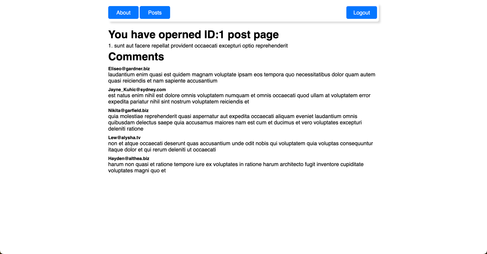

## Feed App

Discover a straightforward feed application that keeps it simple. Browse through your feed on the main page or dive into individual posts for a closer look. Posts searching, post sorting, whatever you need. Want to add something new? Just hit the "Create post" button and watch the modal window opens or remove it with the "Delete" button if you don't like it. Ability to navigate through multiple pages with page pagination. And for a hassle-free experience, enjoy our basic authentication with easy login/logout functionality.

+ Technology Stack: React(including React Hooks), React-Router, Axios

Deployment: https://nikolaitsykin.github.io/feed-app/

Login page

The main page with posts feed

Posts sorting 

Posts creating

Individual post page

Post removing

